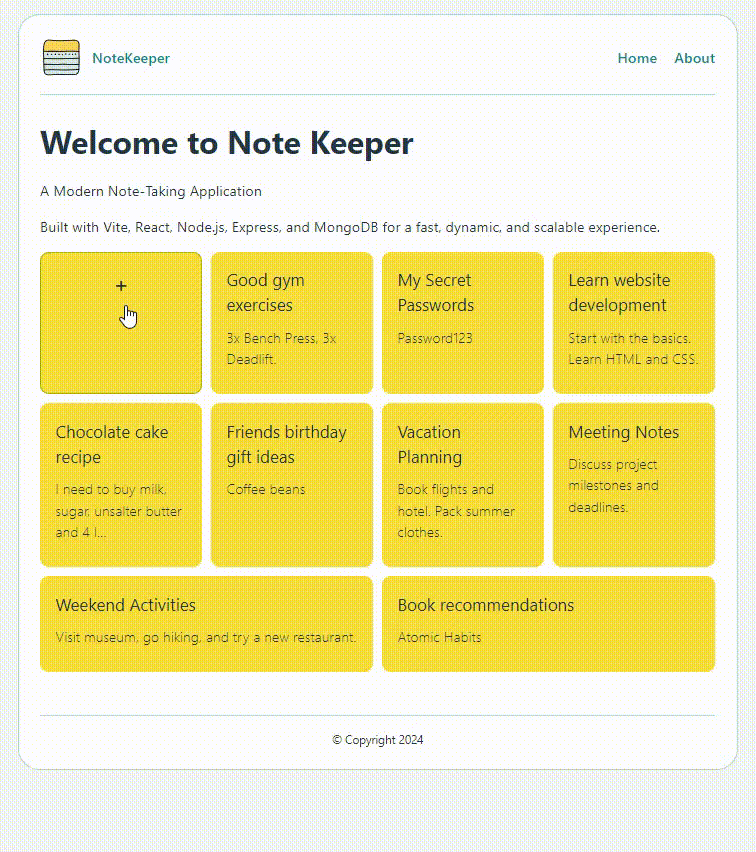

# Note Keeper App

A Note Keeper application built using the MERN stack. This app allows users to add, update, and delete notes efficiently.


## Technologies Used

- **Frontend:** Vite, React
- **Backend:** Node.js, Express
- **Database:** MongoDB

## Features

- **Add Note:** Create a new note with a title and content.
- **Update Note:** Modify the content or title of an existing note.
- **Delete Note:** Remove a note from the list.

## Getting Started

### Installation

1. **Clone the Repository:**

   ```bash
   git clone https://github.com/yourusername/note-keeper-app.git
   cd note-keeper-app

   ```

2. **Frontend Setup:**

   ```bash
    cd client
    npm install
    npm run dev

   ```

3. **Backend Setup:**

   ```bash
    cd server
    npm install

   ```

4. **Create a .env file with your MongoDB connection string:**

```bash
 MONGODB_URI=your_mongodb_connection_string

```

5.  **Start the server:**

```bash
  npm start
```

### Usage

- Open http://localhost:5173 in your browser.
- Add, update, or delete notes using the app interface.
